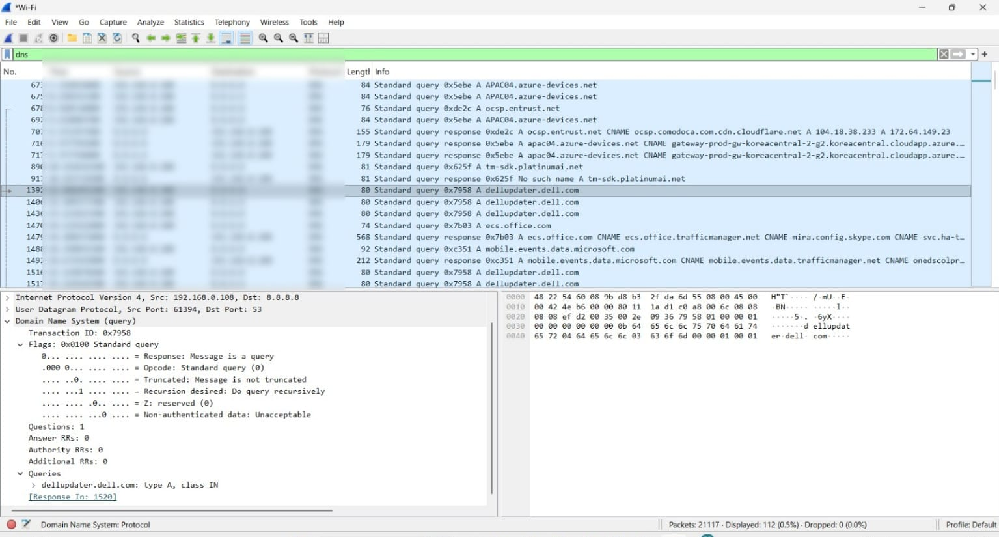
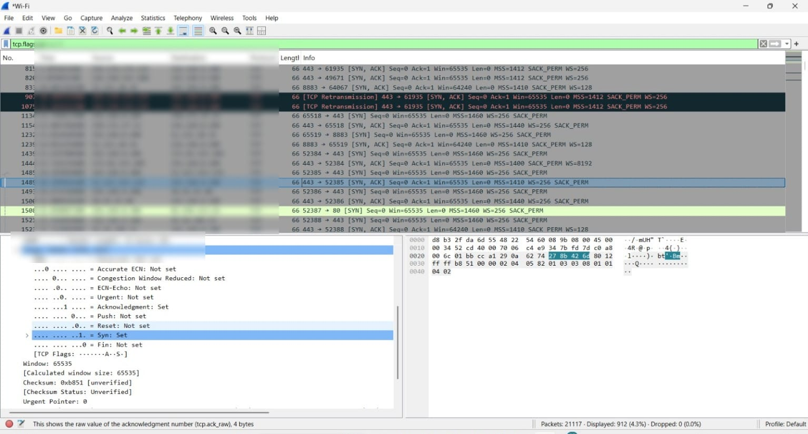
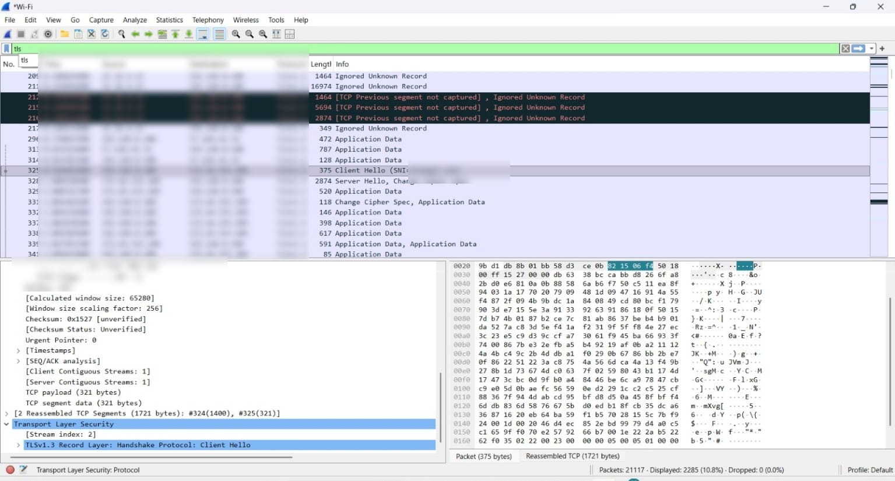

.Network Traffic Analysis and Security Monitoring Using Wireshark

## 📌 Project Overview

This project focuses on capturing and analyzing network traffic using Wireshark in a controlled environment.

The purpose of this project is to understand how different network protocols work during normal Internet communication. The analysis focuses mainly on DNS, TCP, and TLS traffic.

Through this project, I learned how to capture packets, apply Wireshark display filters, identify important packets, and understand what the captured traffic represents.

## 🎯 Objectives

The main objectives of this project are:

- To understand how network traffic is exchanged between a computer and network services.
- To capture live network packets using Wireshark through a Wi-Fi interface.
- To understand basic packet information such as source, destination, protocol, length, and packet details.
- To analyze DNS queries and understand how domain names are resolved to IP addresses.
- To analyze TCP traffic and identify packets containing the SYN flag.
- To understand the purpose of the TCP connection establishment process.
- To analyze TLS traffic and identify a TLS Client Hello packet.
- To learn how Wireshark display filters can be used to analyze specific types of network traffic.
- To develop practical skills in basic network traffic analysis for cybersecurity.

## 🛠️ Tools and Technologies Used

- Wireshark
- Npcap
- Windows
- Web Browser
- Basic Networking Concepts

## 🔍 Methodology

1. Installed Wireshark and Npcap on a Windows system.
2. Connected the laptop to a Wi-Fi network.
3. Selected the Wi-Fi interface in Wireshark.
4. Started a packet capture.
5. Browsed normal public websites for a short period to generate network traffic.
6. Stopped and saved the packet capture.
7. Applied Wireshark display filters to analyze specific protocols.
8. Analyzed DNS traffic and identified a DNS query.
9. Analyzed TCP traffic and identified TCP SYN packets.
10. Analyzed TLS traffic and identified a TLS Client Hello packet.
11. Recorded the observations and documented the results using screenshots.

## 🌐 DNS Analysis

### What is DNS?

DNS (Domain Name System) translates human-readable domain names into IP addresses.

For example, when a computer needs to communicate with a service using a domain name, it can use DNS to find the corresponding IP address.

### What I Analyzed

I applied the following Wireshark display filter:

`dns`

A DNS query for the following domain was observed:

`dellupdater.dell.com`

The query contained:

- Type: A
- Class: IN

### What I Learned

The A record is used to request the IPv4 address associated with a domain name.

This analysis helped me understand how DNS requests appear in captured network traffic and how a computer uses DNS during network communication.

## 🔗 TCP Analysis

### What is TCP?

TCP (Transmission Control Protocol) is a transport-layer protocol that provides reliable communication between devices.

TCP uses a connection establishment process before normal data communication takes place.

### What I Analyzed

First, I filtered TCP traffic using:

`tcp`

Since a large number of TCP packets were present, I used the following filter to identify TCP packets containing the SYN flag:

`tcp.flags.syn == 1`

### What I Learned

The SYN flag is used when initiating a TCP connection.

A simplified TCP connection establishment process is:

Client → SYN → Server

Client ← SYN + ACK ← Server

Client → ACK → Server

This process is commonly known as the TCP three-way handshake.

Using Wireshark filters helped me identify connection-establishment packets without manually examining every TCP packet.

## 🔐 TLS Analysis

### What is TLS?

TLS (Transport Layer Security) is a security protocol used to establish protected communication between a client and a server.

TLS is commonly used for secure web communication such as HTTPS.

### What I Analyzed

I applied the following Wireshark display filter:

`tls`

I then selected a TLS packet and identified a:

TLS Client Hello

### What I Learned

The Client Hello is part of the TLS handshake.

It is sent by the client when beginning the process of establishing a secure TLS connection with a server.

A simplified TLS communication process is:

Client → TLS Client Hello → Server

Client ← TLS Server Hello ← Server

The TLS handshake then continues before secure communication is established.

This analysis helped me understand how TLS is involved in establishing secure communication before protected application data is exchanged.

## 📊 Protocol Analysis Summary

| Protocol | Purpose | What I Observed |
|----------|---------|-----------------|
| DNS | Resolves domain names | DNS A-record query |
| TCP | Provides reliable transport | TCP SYN packets |
| TLS | Establishes secure communication | TLS Client Hello |

These protocols demonstrate different stages of network communication:

DNS → Domain Name Resolution

↓

TCP → Connection Establishment

↓

TLS → Secure Communication

## 📸 Screenshots

### DNS Analysis

### TCP SYN Analysis

### TLS Client Hello

## 📚 What I Learned

Through this project, I gained practical experience in:

- Capturing and analyzing network traffic using Wireshark.
- Using Wireshark display filters to identify specific protocols.
- Analyzing DNS queries and understanding A-record requests.
- Identifying TCP SYN packets and understanding TCP connection establishment.
- Identifying TLS Client Hello packets and understanding the basic TLS handshake.
- Understanding how DNS, TCP, and TLS are involved in network communication.
- Developing basic practical network-analysis skills for cybersecurity.

## ⚠️ Disclaimer

This project was performed for educational purposes using traffic from my own system in a controlled environment.

No unauthorized network traffic was intentionally captured or analyzed.

## 🚀 Future Improvements

Possible future improvements include:

- Automating packet analysis using Python.
- Extracting useful information from packet captures.
- Detecting unusual network traffic patterns.
- Creating a network traffic monitoring dashboard.
- Exploring basic network anomaly detection.